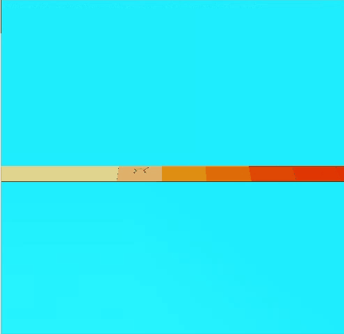

Based on the github_repo [learning to adapt](https://github.com/iclavera/learning_to_adapt).

For running the environments, the Mujoco physics engine version 131 is needed.
For setting up [Mujoco](http://www.mujoco.org/) and [mujoco-py](https://github.com/openai/mujoco-py)

If everything installed properly on running ``` python envs/half_cheetah_blocks_env.py ```, you should see the following rendering.


